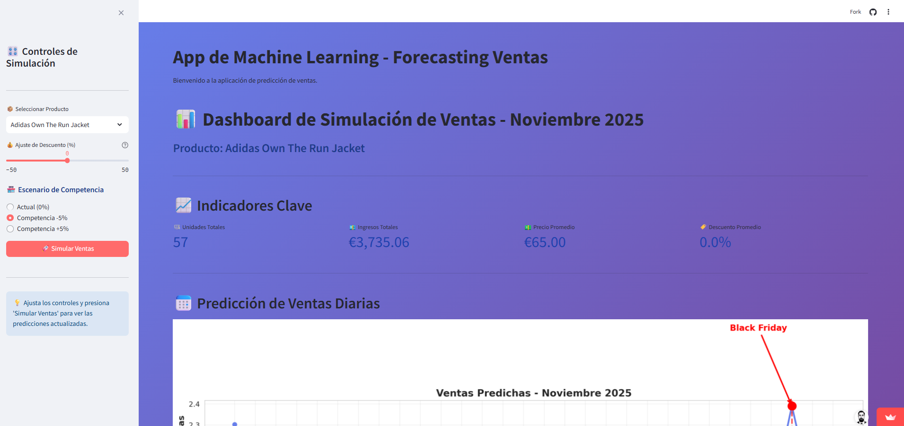

# Retail Sales Forecasting with Machine Learning (Streamlit App)
**Live app:** https://forcasting-ventas-d5kr6phd9ptbqfdaorp3w4.streamlit.app/

## App Preview



Interactive app to forecast retail sales and simulate scenarios (discount and competition) using Machine Learning and Streamlit.

## Project Overview

This project develops a complete end-to-end Data Science workflow to predict product sales and simulate how business decisions impact future demand.

The application allows users to modify variables such as discount levels and competitive scenarios to observe how predicted sales change in real time.

The project replicates a real-world business case in the retail sector, integrating data preparation, machine learning modeling, and interactive deployment.

## Business Problem

Retail companies must anticipate demand to optimize inventory, pricing strategies, and promotional campaigns.

This project builds a predictive model capable of forecasting sales while allowing decision-makers to simulate business scenarios such as:

- Discount adjustments
- Competitive pressure
- Product-level demand changes

## Project Workflow

1. Business problem definition  
2. Data import and preprocessing  
3. Exploratory Data Analysis (EDA)  
4. Feature engineering  
5. Machine learning model training  
6. Model evaluation  
7. Interactive deployment using Streamlit

## Feature Engineering

Several business-oriented variables were created, including:

- Temporal variables (day, month, seasonality)
- Lag features
- Rolling averages
- Discount indicators
- Encoded categorical variables using One Hot Encoding

These features allow the model to capture temporal patterns and promotional effects.

## Machine Learning Model

The forecasting model was trained using:

HistGradientBoostingRegressor

This algorithm was selected due to its performance with tabular data and ability to capture nonlinear relationships between variables.

## Model Evaluation

The model was evaluated using the following metrics:

- MAE (Mean Absolute Error)
- MSE (Mean Squared Error)
- RMSE (Root Mean Squared Error)

These metrics provide insight into prediction accuracy and model stability.

## Key Insights

The forecasting model allows simulation of business scenarios such as discount changes and competitive pressure.

Key insights from the model include:

- Promotional discounts significantly increase predicted sales volume.
- Competitive pressure can reduce demand even when discounts are applied.
- Certain periods, such as promotional events (e.g., Black Friday), show strong demand spikes.

These insights demonstrate how machine learning models can support retail decision-making by forecasting demand under different strategic scenarios.

## Interactive Application

The project includes an interactive web application developed with Streamlit that allows users to simulate business scenarios.

Users can:

- Select different products
- Adjust discount levels
- Simulate competitive pressure
- Visualize predicted sales changes

This approach transforms the machine learning model into a decision-support tool.

## Technologies Used

- Python  
- Pandas  
- NumPy  
- Scikit-learn  
- Streamlit  
- Matplotlib  
- Seaborn  

## Repository Structure
```markdown
forecasting-ventas
│
├── data
│   └── processed
│
├── models
│   └── modelo_final.pkl
│
├── notebooks
│   ├── eda.ipynb
│   └── entrenamiento.ipynb
│
├── src
│   └── app.py
│
├── requirements.txt
└── README.md
```


## Future Improvements

- Incorporate advanced time-series models
- Add scenario comparison dashboards
- Deploy the application in the cloud
- Integrate real-time data pipelines

## Author

Jorge Antonio Medina Trujillo

Data Analyst | Machine Learning Enthusiast | Literature Researcher transitioning into Data Science

LinkedIn: https://www.linkedin.com/in/jorge-medina-analytics
